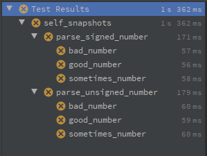

# fn-fixture

This crate provides an easy-to-use annotation for test creation.
There are three aspects to each fixture:

* A function that takes an input and has a return type that
implements `std::fmt::Debug`.

* A folder of sub-folders (further nested as desired, it need not be
consistent) where every tree-terminating folder contains a single
input file (`.rs` `.txt` `.bin`) corresponding to the input type of
the function.

* The expected results, generated automatically when not present. A
panic can be considered a valid possible expected result.

This project follows convention not configuration. Input files are
simply named: `input.rs` `input.txt` `input.bin`. Expected-output
files are named by the name of the fixture. This means multiple
fixtures can share a folder-tree of tests. You are not intended to
make the output file yourself; one will be generated automatically
when an expected result is not present.

[](https://crates.io/crates/fn-fixture)
[](https://docs.rs/fn-fixture)
[](https://crates.io/crates/fn-fixture)

## Usage

```toml
[dev-dependencies]
fn-fixture = "1.0.0"
```

### Dogfood

This project uses itself to test itself, which triples as an example
and a technical explanation.

`snapshot-tests` has four test-trees:

* The [`source`](snapshot-tests/source) tree gives an explanation of
how tests get generated. This is also the primary means of testing
`fn-fixture` itself. These tests reference the other two test-trees.

* The [`code`](snapshot-tests/code) tree gives an example of what
tests do when fed into the identity function. This is a tertiary
means of testing `fn-fixture` itself.

* The [`bad`](snapshot-tests/bad) tree gives examples of improperly
formed tests that result in compile-errors. These aren't tested
directly by `fn-fixture`, but rather the expected compile-failure
macroes are used in [`source/bads`](snapshot-tests/source/bads)

* The [`example`](snapshot-tests/examples) tree follows the direct
example below.

[`self_snapshots.rs`](tests/self_snapshots.rs) is the file that uses
`fn-fixture` to run these tests.

### Example

This example is part of the project, both for generation and
execution. To see the code generation in action, refer to
[`snapshot-tests/source/examples`](snapshot-tests/source/examples).
To see the file structure, refer to
[`snapshot-tests/examples`](snapshot-tests/examples).

#### Make tests

This tests parsing a number from a text file:

```rust
#[fn_fixture::snapshot("snapshot-tests/examples")]
fn parse_unsigned_number(value: &str) -> Result<usize, impl std::fmt::Debug> {
    value.parse()
}

#[fn_fixture::snapshot("snapshot-tests/examples")]
fn parse_signed_number(value: &str) -> Result<isize, impl std::fmt::Debug> {
    value.parse()
}
```

`snapshot-tests/examples/bad_number`:
```text
forty two
```

`snapshot-tests/examples/good_number`:
```text
42
```

`snapshot-tests/examples/sometimes_number`:
```text
-42
```

#### Run tests initially

On first run, `cargo test` will have 6 tests (2 fixtures with 3
snapshots each) looking like this:
```text
test parse_signed_number::sometimes_number ... FAILED
test parse_signed_number::good_number ... FAILED
test parse_unsigned_number::sometimes_number ... FAILED
test parse_unsigned_number::good_number ... FAILED
test parse_unsigned_number::bad_number ... FAILED
test parse_signed_number::bad_number ... FAILED
```

IntelliJ automatically structures the tests for you:



The specific errors will look like this:
```text
thread 'parse_unsigned_number::bad_number' panicked at 'No expected value set: ... 
```

Each snapshot folder, `bad_number` `good_number` and
`sometimes_number`, will now have both
`parse_signed_number.actual.txt` and
`parse_unsigned_number.actual.txt`.

The `bad_number` results will have:
```text
Ok(
    Err(
        ParseIntError {
            kind: InvalidDigit,
        },
    ),
)
```

The `good_number` results will have:
```text
Ok(
    Ok(
        42,
    ),
)
```

The `sometimes_number` will have the same results match for
`parse_unsigned_number` and `parse_signed_number` respectively.

* Note, the outer-most `Ok(` represents that the thread did not
panic. If you expect a panic, then the outer-most should be `Err(`.

Lastly, you review each `.actual` file manually. If the file is
correct, remove `.actual`. If not, continue to modify your code run
the tests; `.actual` will be overwritten with the results each run.

#### Later

At some point, your output may change. For example, if one character
of `shapshot-tests/examples/bad_number/parse_unsigned_number.txt`
changes (like manually removing an `i` from the expected output), the
test result will look like this:
```text
---- parse_unsigned_number::bad_number stdout ----
thread 'parse_unsigned_number::bad_number' panicked at 'assertion failed: `(left == right)`
  left: `"Ok(\n    Err(\n        ParseIntError {\n            kind: InvalidDigit,\n        },\n    ),\n)\n"`,
 right: `"Ok(\n    Err(\n        ParseIntError {\n            kind: InvaldDigit,\n        },\n    ),\n)\n"`', fn-fixture\tests\self_snapshots.rs:19:1
```

#### Internally

The generated code for this example will look like this
(simplified/paraphrased to remove some edge-case handling and
boilerplate):

```rust
fn parse_unsigned_number(value: &str, expected_file: &str) {
    fn parse_unsigned_number(value: &str) -> Result<usize, impl std::fmt::Debug> {
        value.parse()
    }
    // omitted logic for panic-handling
    // omitted logic for writing actual file instead
    assert_eq!(
        format!("{:#?}\n", parse_unsigned_number(value)),
        File::read_to_string(expected_file),
    );
}
mod parse_unsigned_number {
    #[test] fn bad_number() { super::parse_unsigned_number(include_str!("snapshot-tests/examples/bad_number/input.txt"), "snapshot-tests/examples/bad_number/parse_unsigned_number.txt") }
    #[test] fn good_number() { /* ... */ }
    #[test] fn sometimes_number() { /* ... */ }
}

fn parse_signed_number(value: &str, expected_file: &str) {
    fn parse_signed_number(value: &str) -> Result<isize, impl std::fmt::Debug> {
        value.parse()
    }
    // omitted logic for panic-handling
    // omitted logic for writing actual file instead
    assert_eq!(
        format!("{:#?}\n", parse_signed_number(value)),
        File::read_to_string(expected_file),
    );
}
mod parse_signed_number {
    #[test] fn bad_number() { super::parse_signed_number(include_str!("snapshot-tests/examples/bad_number/input.txt"), "snapshot-tests/examples/bad_number/parse_signed_number.txt") }
    #[test] fn good_number() { /* ... */ }
    #[test] fn sometimes_number() { /* ... */ }
}
```

### Input types

* `input.txt` corresponds to `include_str!(...)`
* `input.bin` corresponds to `include_bytes!(...)`
* `input.rs` corresponds to `include!(...)`
  * The type from `input.rs` can be literally anything that fits into
  the single-parameter of the call to the fixture.
  [`snapshot-tests/code`](snapshot-tests/code) has plenty of examples
  of using a rust code as input.

### Restrictions

* The name of the fixture may not be `input`. That would mean the
expected output is `input.txt`; call it `quine` instead.

* Expected-panics should be `String` or `&str`. This should rarely,
if ever, be an issue. Every known library uses those.
`panic!("At the disco")` for example is a `&str` and
`unwrap()`/`expect(...)` use `String`. 

* Multiline string output should be wrapped in a
`.lines().collect::<Vec<String>>()`. These tests are for humans to
review. IntelliJ will diff it for you.

* Every terminating directory (one without sub-directories) must have
exactly one `input` file.

* A directory with sub-directories may not have an `input` file.

* The referenced folder is a top-level, not a test itself.

* Adding new tests without touching the including file or clearing
the compiler cache will be ignored. This is a compiler-level
restriction.

* Every folder in a tree must be a valid rust identifier. These are
how nested test modules are named.

* Adding other files into the folder is discouraged, and future
versions may treat them as an error.

* Return type must implement `std::fmt::Debug`.

* Annotating a field is unsupported, even if it's callable.

### Tips

* Use `impl std::fmt::Debug` as the return type.

* Use a different function for different parts of the output; don't
have one function parse input two different ways.

* Although this library supports panics as expected output, testing
that behavior is discouraged.

* Name your directory `snapshot-tests`. Snapshot explains what kind
of test, and IDEs may recognize a directory ending in `-tests`.

* Generics work for multiple `input.rs` files of different types.

## License

This application is derived from an internally developed tool, thus
released under the MIT License:
